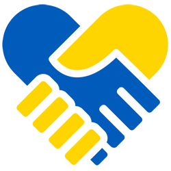

<h1 align="center">Hi 👋, we're UkrAID</h1>
<h3 align="center">A team of passionate developers from Cologne, Germany, looking to play our part in the Ukraine war.</h3>

- 💡 UkrAID is a crowd-sourced platform providing valuable and reliable information for Ukrainians directly affected by the chrisis and those seeking to help internationally

- 🌱 Anybody is welcome to contribute to our GitHub repository (https://github.com/juliusappel/ukrAID)

